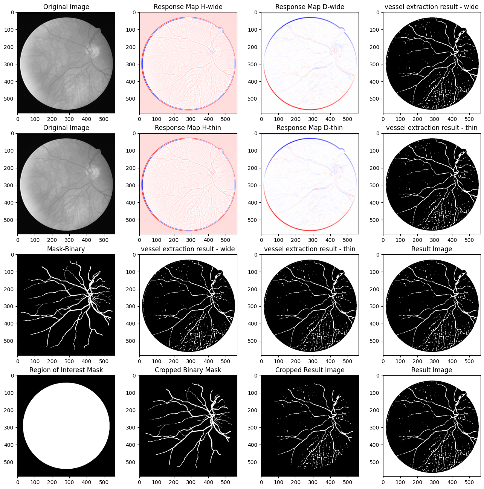

# Retinal Vessel Extraction

This project is part of the COMP 6771 - Image Processing course at Concordia University. The implemented Python code realizes the method proposed by Bob Zhang in the paper titled "Retinal vessel extraction by matched filter with first-order derivative of Gaussian" [DOI Link](https://www.sciencedirect.com/science/article/abs/pii/S0010482510000302).

## Overview

The goal of this project is to perform retinal vessel extraction using the method described in Bob Zhang's paper. The implemented code applies a matched filter with the first-order derivative of Gaussian to enhance the visibility of retinal vessels in digital retinal images.
## Process

## Features
- Feature 1: Implementation in Python
- Feature 2: Achieved high accuracy in Retinal vessel extraction from digital retinal images.

## Result

